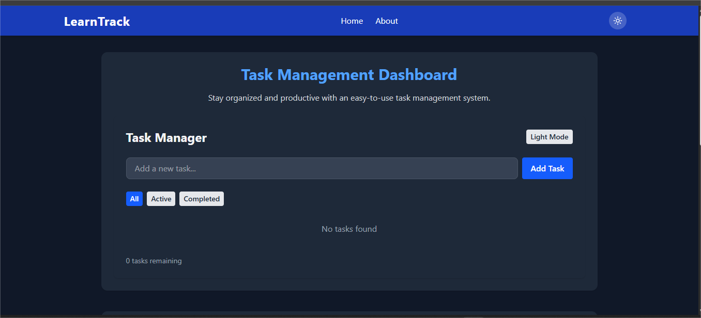
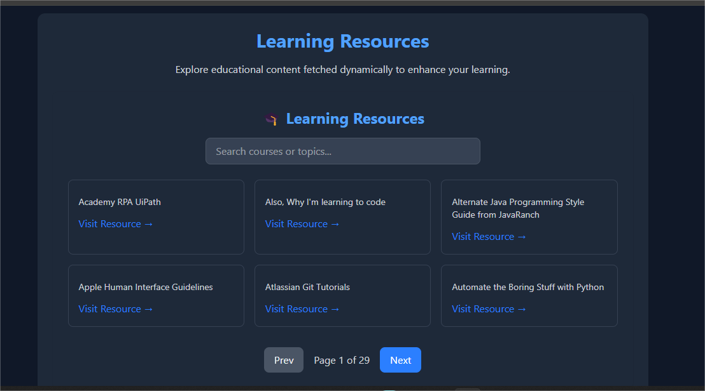

# LearnTrack - Task Management & Learning Resources

A modern React application that combines task management capabilities with educational resources, built using React, Tailwind CSS, and Vite.

## 🚀 Features

- **Task Management**
  - Create, complete, and delete tasks
  - Filter tasks by status (All/Active/Completed)
  - Persistent storage using localStorage
  
- **Learning Resources**
  - Browse coding resources from public API
  - Search and filter resources
  - Pagination support
  
- **Modern UI/UX**
  - Responsive design for all devices
  - Dark/Light theme support
  - Smooth animations and transitions
  - Component-based architecture

## 🛠️ Technologies

- React 
- Tailwind CSS 
- React Router 
- Vite 
- ESLint 
- Lucide React (for icons)

## ⚙️ Prerequisites

- Node.js (v18 or higher)
- npm (comes with Node.js)

## 📦 Installation

1. Clone the repository:
   ```bash
   git clone <repository-url>
   cd LearnTrack

2. Install dependencies:
   npm install

3. Create a .env file in the root directory:
   VITE_API_URL=https://your-api-endpoint-here


npm run dev
The application will be available at http://localhost:5173

Project Structure

LearnTrack/
├── public/           # Static assets
├── src/
│   ├── components/   # Reusable UI components
│   ├── context/      # React context providers
│   ├── hooks/        # Custom React hooks
│   ├── pages/        # Page components
│   ├── App.jsx       # Root component
│   └── main.jsx      # Entry point
├── index.html
└── package.json

🔧 Configuration Files

vite.config.js - Vite configuration
tailwind.config.js - Tailwind CSS configuration
eslint.config.js - ESLint configuration
jsconfig.json - JavaScript configuration


🎨 Component Library

Button - Customizable button with different variants
Card - Container component for content
Navbar - Navigation component with theme toggle
TaskManager - Task management functionality
ApiData - Learning resources display


🌙 Theme Support
The application supports both light and dark themes:

Automatically detects system preference
Allows manual toggle
Persists theme choice

📱 Responsive Design
Built with a mobile-first, fully responsive layout using Tailwind’s utility classes.

🤝 Contributing
Fork the repository
Create a feature branch
Commit your changes
Push to the branch
Open a pull request


## 🖼️ Preview

Here’s a preview of **LearnTrack** in action:



